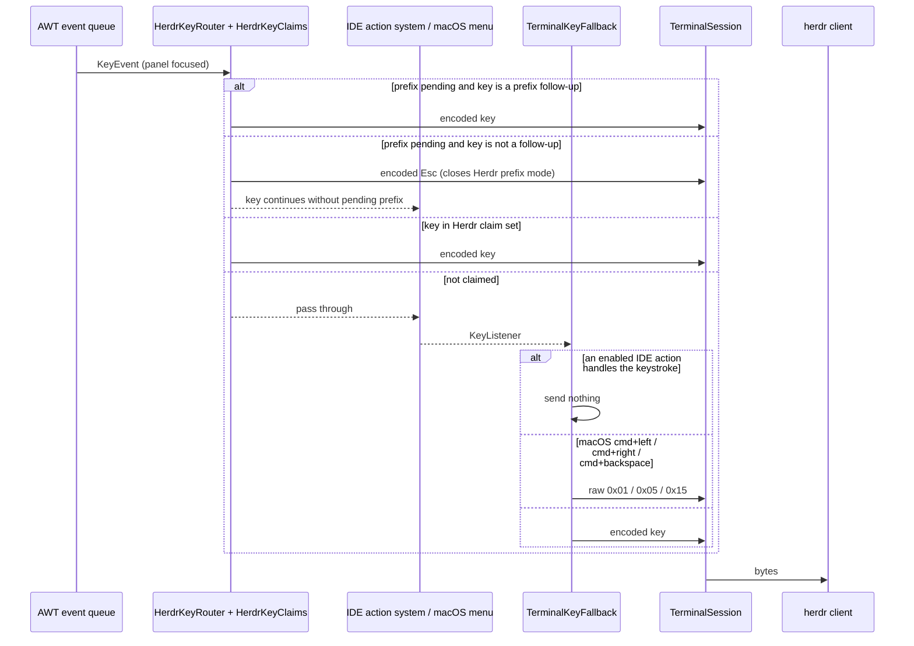

## Context

Motivation: `proposal.md`. Behaviour: `specs/`. Owning intent: `/Users/codaveto/Brainspace/intents/herdr-intellij-tool-window/herdr-intellij-tool-window.md`. The panel, key routing and screen drawing come from the unarchived change `add-herdr-intellij-tool-window` (its design D2 and D4).

### Build steps

Decided by the planner from the investigation; Brian asked not to be asked about these bugs.

| Team | Included | Reason |
| --- | --- | --- |
| Product | yes | The spec deltas of this change; written during planning. |
| Data Models | no | No model or DTO changes. |
| Design | no | No visual design change; the fixes restore the intended look. |
| Live Prototype | no | Nothing to click through before code. |
| Frontend Components | yes | `TerminalCanvas` draws text off its cell grid (DAS-192). |
| Agent Tools | no | No CLI command, agent tool or skill changes. |
| Shared Packages | no | No shared package. |
| Backend | yes | Integration with the pty and libghostty-vt: frame publishing in `TerminalSession` (DAS-196). |
| Frontend | yes | The panel's key flow: prefix follow-up, macOS line-editing chords, IDE-handled shortcuts (DAS-194). |
| Testing | no | The repository has no e2e suite for a GUI IDE; real-key checks in a sandbox IDE are the Verification group. |
| Infra | yes | The issues' acceptance asks for a new Marketplace version; the existing `publish` pipeline runs on a `v*` tag. |

### Reproduced failures and root causes

Reproduced on 2026-09-30 in a sandbox IntelliJ 2026.1.2 (`./gradlew runIde`, main `ecc7d73`) on an isolated Herdr session, with real macOS key events (CGEvent) and the panel's `herdr.panel.read` / `herdr.panel.capture` actions. Evidence comments are on DAS-196, DAS-192 and DAS-194.

**DAS-196, stale rows after a tab switch.**
- Failure: in 30 of 32 Herdr tab switches the last one or two rows kept the old tab's content, still wrong 6 s later. One more output byte fixed the screen.
- Cause: `TerminalSession.readLoop` queues `terminal.feed(chunk)` on the single terminal thread, then calls `requestFrame`. `requestFrame` queues one publish task and skips while `framePending` is true. The thread runs tasks in order, so with chunks 1 and 2 the queue is `feed1, publish, feed2`: the publish runs before `feed2`, and no publish follows `feed2`. The last chunk of a burst is never shown until more output arrives.

**DAS-192, caret drifts from text.**
- Failure: in a 57-column panel (456 px), glyphs advance about 7.8 px while cells are 8 px; at column 34 the caret was about 6 px off, and the gap grows with the column.
- Cause: `TerminalCanvas.setLook` sets `cellWidth = fm.charWidth('W')`, an integer, while `paintComponent` turns on fractional metrics. `paintRow` draws an ASCII run with one `drawString` at the run's first cell, so the glyphs inside the run advance by the fractional width. Backgrounds, selection and the caret use `x * cellWidth`. Text and grid drift apart inside each run.

**DAS-194 (a), macOS line-editing chords.**
- Failure: Cmd+Left and Cmd+Right reach the pane as `ESC[1;9D` / `ESC[1;9C`, and Cmd+Backspace as `DEL`. Ghostty sends `^A`, `^E` and `^U`.
- Cause: Ghostty's `^A`/`^E`/`^U` are app-level keybinds (`text:` actions in `.cache/ghostty/src/config/Config.zig` 7313-7342), not key encoder output. The plugin uses only the encoder. `TerminalKeyFallback` sends the chord to the encoder.

**DAS-194 (b), IDE shortcuts after the prefix.**
- Failure: after `ctrl+;`, Cmd+O went to Herdr only and IntelliJ did nothing.
- Cause: `HerdrKeyClaims.claim` returns `HERDR` for any key while `prefixPending`, without `keymap.bindsAfterPrefix`. Herdr then drops an unbound follow-up (`herdrdev/herdr` `src/client/shell/input.rs` 575-585).
- Herdr facts the fix rests on: prefix mode lasts one key; Esc closes it without forwarding (570-573); a second prefix press forwards the prefix key to the pane (565-568); an unbound key is dropped; there is no timeout; Herdr shows a PREFIX mode bar while it is open (`render.rs` 86-98).

**DAS-194 (c), stray character on an IDE-handled shortcut.**
- Failure: Cmd+comma opened Settings and also put `,` in the pane. Seen once.
- Cause, code path: `cmd+comma` is not in Herdr's claim set, so `HerdrKeyRouter` passes it on. `TerminalKeyFallback.keyPressed` sends every press with cmd that is not `isConsumed`, on the press itself. [INFERENCE] Herdr receives `super+comma` and forwards it to the pane as `,`.
- Cause, why the press is not consumed: [INFERENCE] on macOS the menu bar runs the Settings item's key equivalent natively, so the AWT press reaches the panel's `KeyListener` unconsumed. Task 3.1 confirms this with a reproduction before the fix.

### Code map

All paths under `src/main/kotlin/dev/appboypov/herdridea/`.

| File | Role | Change |
| --- | --- | --- |
| `terminal/shared/services/TerminalSession.kt` | pty reader, terminal thread, frame publishing, key sink | frame coalescing (D1); raw input for D3 |
| `terminal/shared/components/TerminalCanvas.kt` | Swing painting on the cell grid | glyph placement (D2) |
| `herdr/shared/services/HerdrKeyClaims.kt` | who handles a keystroke | prefix follow-up rule (D4) |
| `herdr/shared/services/HerdrKeyRouter.kt` | `IdeEventQueue` dispatcher applying the claims | closes Herdr's prefix mode (D4) |
| `terminal/shared/services/TerminalKeyFallback.kt` | sends keys no IDE action consumed | macOS chords (D3); IDE-handled check (D5) |
| `herdr/shared/views/herdrpanel/HerdrPanelView.kt` | wires router and fallback to the view model | passes what D3 to D5 need |
| `herdr/shared/models/HerdrKeymap.kt` | `bindsAfterPrefix` | reused as is |

Reuse: `HerdrKeymap.bindsAfterPrefix`, `AwtKeyTranslator`, `HerdrKeyStrokes.of`, the view model's key path. Tests: `src/test/.../TerminalSessionTest.kt` (real session through `/bin/sh`), `HerdrKeyClaimsTest.kt`.

## Goals / Non-Goals

**Goals:**
- The four spec'd behaviours in `specs/herdr-key-routing` and `specs/herdr-tool-window`.
- A 0.1.1 plugin release (0.1.0 is the only Marketplace version).

**Non-Goals:**
- DAS-191 and DAS-193 (closed, not plugin bugs).
- Porting Ghostty's alt+left / alt+right text defaults or any other Ghostty keybinding.
- Changing the named actions' arguments or behaviour.
- Glyph caching or other paint performance work.

**Always:**
- Herdr's claimed keys win (ADR-0003, restated by ADR-0004).
- Painting stays on the EDT from immutable `ScreenFrame`s; native handles stay on the terminal thread (ADR-0002).

**Never:**
- Send a keypress to the pane that an enabled IDE action handled.
- Delay frames with a timer.

## Decisions

### D1. Frames are coalesced on the terminal thread, after the last queued chunk
The decision to publish moves to the terminal thread: a frame is published once no output chunk that was read is still waiting to be fed. A burst of chunks still yields one frame, and that frame always includes the last chunk.
- *Over publishing after every chunk:* correct, but one snapshot per 64 KiB chunk during large redraws.
- *Over a debounce timer:* adds latency and a timer thread; the queue already orders the work.

### D2. Every glyph is placed at its own cell
A batched ASCII run keeps one draw call but places each glyph at `x * cellWidth` (for example a glyph vector with explicit positions), so text, backgrounds, selection and the caret use the same grid. `cellWidth` stays an integer; a glyph narrower than its cell leaves a small gap, as in Ghostty.
- *Over one `drawString` per cell:* same result with many more draw calls per row (ADR-0002 follow-up on repaint cost).
- *Over turning fractional metrics off:* at 2x scale the advance can still be a fraction of a user-space pixel; it hides the drift at some sizes only.

### D3. macOS line-editing chords are sent as raw bytes by the fallback
On macOS, when the fallback would send `cmd+left`, `cmd+right` or `cmd+backspace` without other modifiers, it sends the raw bytes 0x01, 0x05 or 0x15 on press and repeat, and nothing on release. The bytes bypass the key encoder, as Ghostty's `text:` binding does, so the Kitty keyboard protocol does not change them. Herdr-claimed keys never reach the fallback, so a Herdr binding for these chords still wins.
- *Over encoding `ctrl+a` through the key encoder:* in Kitty mode that becomes a `CSI u` sequence, which Ghostty does not send.
- *Over mapping in `TerminalSession.key`:* the session also receives Herdr-claimed keys, which must stay unmapped.

### D4. A pending prefix yields only to Herdr's prefix follow-ups
While the prefix is pending, a key is a prefix follow-up when `keymap.bindsAfterPrefix` is true, when it is the prefix key itself (Herdr forwards it to the pane), or when it is Esc (Herdr closes prefix mode). A follow-up goes to Herdr as before. Any other key, a non-bindable one included, makes the router first send Esc to Herdr, which closes prefix mode without forwarding, and then routes the key as if no prefix were pending. The pending state clears on the follow-up key in both cases.
- *Over routing the key without closing prefix mode:* Herdr would stay in prefix mode after an IDE shortcut, and a later plain key would run a Herdr prefix action.
- *Over dropping an unbound plain follow-up, as Herdr does:* the plugin cannot tell before the action system runs whether the IDE will handle it; after Esc the key simply follows normal routing, so `ctrl+;` then an unbound `x` types `x`.
- Supersedes ADR-0003's "a pending prefix's follow-up key" claim: ADR-0004.

### D5. The fallback sends nothing for a keystroke an enabled IDE action handles
Before the fallback sends a press, it asks the IDE's action system whether an enabled action in the panel's context handles that keystroke under the active keymap. If one does, the fallback sends nothing for that press, its typed event and its release. Keys whose actions are disabled in the panel, such as editor actions on `cmd+left`, still go to Herdr, as ADR-0003 requires.
- *Over dropping every unclaimed cmd chord on macOS:* breaks keys with no enabled IDE action that programs in the pane rely on.
- *Over detecting focus loss after the press:* timing-dependent, and misses shortcuts that keep focus in the panel.

## Risks / Trade-offs

- [Risk] D5's cause is inferred for the menu-bar path → task 3.1 reproduces the unconsumed press first; if the cause differs, the plan changes through `madspec-revise-plan`.
- [Risk] An IDE action enabled in the panel's context that Brian expects in the pane now stops reaching it → matches ADR-0003's rule that enabled IDE actions win; the sandbox check covers Cmd+Left/Right/Backspace, whose editor actions are disabled there.
- [Risk] `ctrl+;` then an unbound plain key types that key instead of Herdr dropping it → accepted; it is a mistyped sequence, and the result is visible.
- [Trade-off] Explicit glyph positions draw ligature-capable fonts without ligatures in ASCII runs → the terminal grid needs one glyph per cell.

## Migration Plan

Merge, then tag `v0.1.1` on main; the `publish` workflow builds natives, runs `check`, and publishes to the Marketplace default channel. Rollback: publish a later version with the previous behaviour; Marketplace versions are not deleted.

## Open Questions

None.
